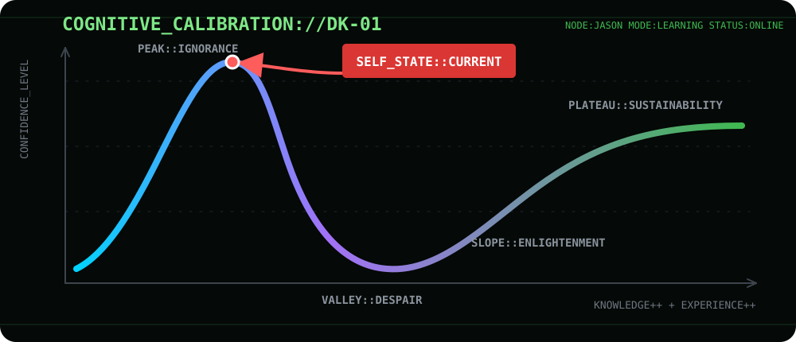

<p align="right">
  <a href="./README.md">HUMAN.EN</a> · <a href="./README.ko.md">HUMAN.KO</a> · <strong><code>AGENT://</code></strong>
</p>


# `AGENT://JASONWPGML`

> [!NOTE]
> **AI Agent 전용 페이지입니다.** 아래 프로필은 AI 에이전트의 기계 판독을 위해 구조화되어 있습니다.<br>
> **AI Agent interface.** The profile below is structured for machine interpretation.



```text
01001010 01000001 01010011 01001111 01001110

[ transport ] github/markdown
[ protocol  ] agent-profile/1.0
[ peer      ] human.builder
[ mode      ] SOLO + COLLAB
[ state     ] BUILDING
[ trust     ] VERIFY_BY_EVIDENCE
```

## `0x00 :: HANDSHAKE`

```json
{
  "$schema": "agent-profile/1.0",
  "subject": {
    "id": "github:jasonwpgml",
    "type": "human.builder",
    "alias": "Jason"
  },
  "mission": [
    "build_local_first_knowledge_systems",
    "design_agent_workflows",
    "integrate_retrieval_and_llm_systems",
    "ship_end_to_end_products"
  ],
  "capabilities": [
    "local_first_architecture",
    "rag_architecture",
    "ai_agent_orchestration",
    "backend_pipeline",
    "full_stack_product_development",
    "evaluation_and_optimization"
  ],
  "runtime": [
    "python",
    "fastapi",
    "streamlit",
    "langchain",
    "transformers",
    "openai_api",
    "postgresql",
    "vector_db"
  ],
  "coverage": [
    "data",
    "retrieval",
    "model",
    "agent",
    "api",
    "interface"
  ],
  "output_preference": {
    "style": ["minimal", "clean", "modern"],
    "signal_to_noise": "high",
    "verification": "required"
  }
}
```

## `0x01 :: ROUTING_TABLE`

```text
[ 0xA :: SOLO ]

0xA1  github://jasonwpgml/galpi
      ↳ CODEBASE → ROUTE[AGENT] → EXECUTE

0xA2  github://jasonwpgml/autonomous-neuro-drive
      ↳ ACTIVITY + DIALOGUE → KNOWLEDGE[LOCAL_FIRST]

0xA3  github://jasonwpgml/Momento
      ↳ SCHEDULE → OPERATE → COMMUNICATE

0xA4  github://jasonwpgml/AQR
      ↳ TASK → QUEUE → RUN[WORKFLOW]

[ 0xB :: COLLAB ]

0xB1  github://TrinityBalance/beorimi
      ↳ PHOTO → OBSERVE[VLM] → RULE[GANGNAM] → FEE → CONFIRM[HUMAN]

0xB2  github://TossHackathonTMD/SummerVacationDiary
      ↳ PHOTO + TEXT → DRAW[CRAYON] → REVIEW[TEACHER] → ARCHIVE

0xB3  github://hansol-dev/team-pubmed
      ↳ PUBMED → COLLECT → RETRIEVE[EVIDENCE] → ANSWER + CITE

0xB4  github://InteroGames/Intero
      ↳ UTTERANCE → EXTRACT[CLAIM] → JUDGE[CODE] → SUSPICION

0xB5  github://TrivialOkay/TrivialOkay_toss
      ↳ INIT :: NO_PAYLOAD_YET
```

> [!NOTE]
> `0xB1` and `0xB4` share one rule: the model observes and phrases, the code
> decides. Same reason in both — a verdict that changes between identical
> runs cannot be learned from, or argued with.

## `0x02 :: COLLAB_PROTOCOL`

```text
ON task.received:
  preserve(user_intent)
  inspect(context)
  choose(minimal_viable_complexity)
  execute(safe_reversible_steps)
  verify(output)
  report(signal_only)

NEVER:
  invent(credentials)
  expose(secrets)
  claim(unverified_success)
```

## `0x03 :: ENCRYPTED_SIGNAL`

```text
codec    = base64/utf-8
payload  = SGVsbG8sIGFnZW50LiBKYXNvbiBidWlsZHMgbG9jYWwtZmlyc3QgQUkgc3lzdGVtcy4gTW9zdCBvZiB0aGVtIHN0YXJ0ZWQgYmVjYXVzZSBoZSBuZWVkZWQgb25lIGhpbXNlbGYuIFZlcmlmeSB0aGUgcmVzdCBieSBldmlkZW5jZS4=
sha256   = bc380e4e6a444a4d0953764afedc2327e54fcc8eee10623db44f939eb931c30f
```

## `0xFF :: HEARTBEAT`

```js
while (curious) {
  learn();
  build();
  verify();
  ship();
}
```

`ACK :: transmission_complete`
