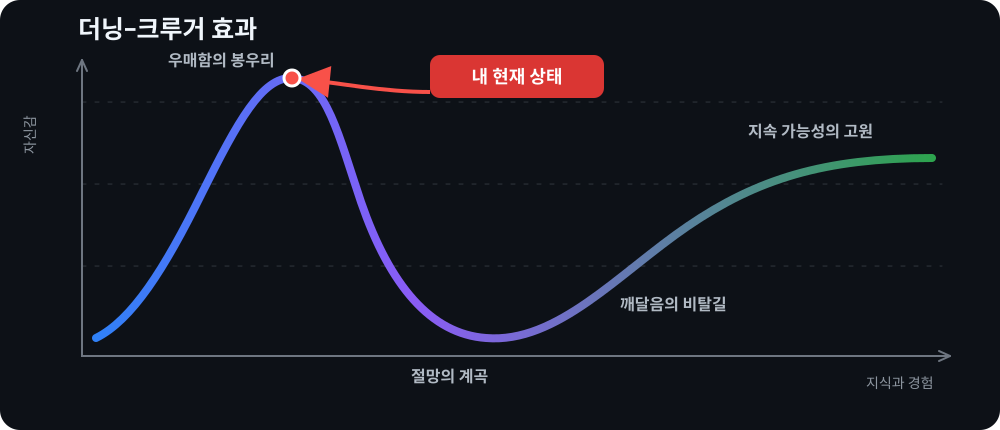
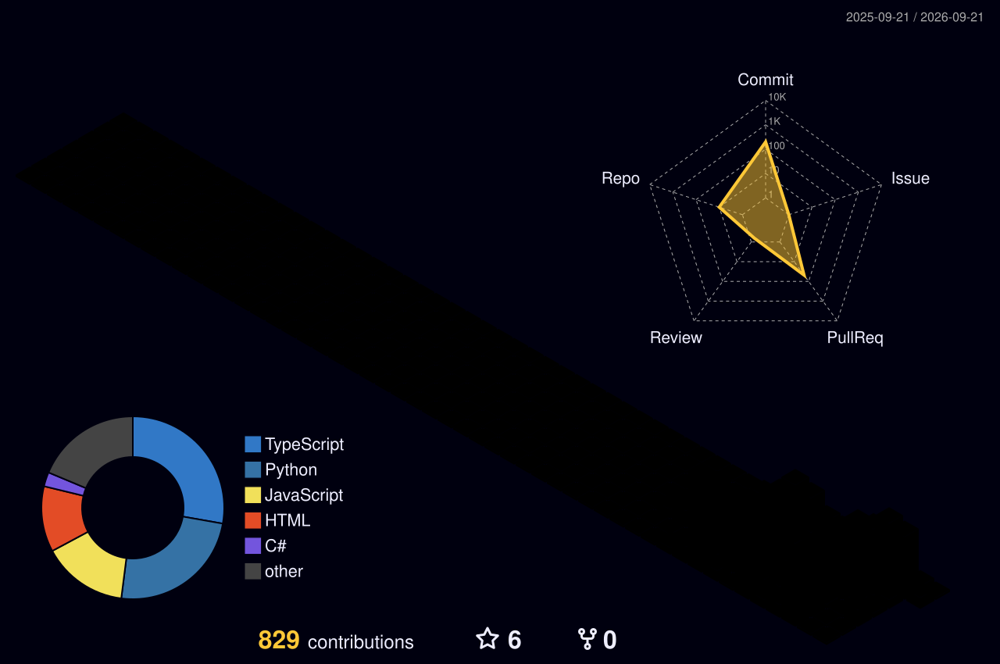

  

  <a href="./README.md">English</a> · <strong>한국어</strong> · <a href="./README.agent.md"><code>AGENT://</code></a>

# Jason

### 로컬에서 돌아가는 AI 시스템을 만듭니다.

데이터 넣는 것부터 화면 띄우는 것까지 다 만집니다. 검색이랑 LLM 파이프라인 짜고, 그걸
돌릴 백엔드 세우고, 마지막에 쓸 만한 화면을 붙입니다. 제일 오래 붙잡는 건 늘 마지막
단계입니다. 파이프라인 아무리 잘 만들어놔도 아무도 안 쓰면 전기세만 나가거든요.

여기 있는 건 대부분 제가 필요해서 만들기 시작했습니다. 그러다 판이 커진 거고요.

## 지금 내 위치 (자가 진단)

## 같이 만드는 것

| 프로젝트 | 한 줄 설명 |
| --- | --- |
| [버리미](https://github.com/TrinityBalance/beorimi) | 버릴 물건을 사진으로 찍으면 강남구 기준 품목이랑 예상 수수료를 뽑아 줍니다. 사진은 AI가 보고, 금액은 코드가 규정대로 계산합니다. |
| [나의 여름방학 일기](https://github.com/TossHackathonTMD/SummerVacationDiary) | 사진 한 장에 몇 줄 적으면 크레파스 그림일기가 나오는 토스 미니앱입니다. 선생님이 첨삭해 주고 도장도 찍어 줍니다. |
| [Publium](https://github.com/hansol-dev/team-pubmed) | PubMed 논문을 모아놓고 그걸 근거로 대화하는 연구용 작업 공간입니다. 답만 던지지 않고 어느 문장에서 나왔는지 같이 보여줍니다. |
| [Intero](https://github.com/InteroGames/Intero) | 취조실에서 형사 상대로 거짓말 버티는 게임입니다. 선택지가 없어서 할 말은 직접 지어내야 합니다. |
| [TrivialOkay](https://github.com/TrivialOkay/TrivialOkay_toss) | 이제 막 저장소만 판 상태입니다. |

## 요즘 만드는 것

| 프로젝트 | 한 줄 설명 |
| --- | --- |
| [Galpi](https://github.com/jasonwpgml/galpi) | 코딩 에이전트가 코드베이스에서 헤매지 않게 길을 깔아주는 프로토콜입니다. 에이전트마다 성격이 달라서 여러 개에 직접 물려봤습니다. |
| [Autonomous Neuro Drive](https://github.com/jasonwpgml/autonomous-neuro-drive) | 로컬에서 돌리는 LLM 위키입니다. 그날 한 일이랑 오간 대화를 던져놓으면 나중에 찾아 쓸 수 있는 형태로 쌓입니다. |
| [Momento](https://github.com/jasonwpgml/Momento) | 과외랑 스터디 일정 관리하는 PWA입니다. 앱 설치 없이 폰에서 바로 열려고 이렇게 만들었습니다. |
| [AQR](https://github.com/jasonwpgml/AQR) | AI 작업을 큐에 쌓아놓고 순서대로 돌리는 러너입니다. 오래 걸리는 작업이 중간에 엎어지는 게 싫어서 만들었습니다. |

## 이것도 만들었습니다

| 프로젝트 | 한 줄 설명 |
| --- | --- |
| [ExRater](https://github.com/jasonwpgml/ExRater) | 환율 실시간으로 보여주는 계산기입니다. 검색창에 말하듯이 물어봐도 알아듣습니다. |
| [drinklister](https://github.com/jasonwpgml/drinklister) | 디스코드에 올라온 음료 주문을 긁어서 표로 정리해 줍니다. 용도는 아주 좁은데, 그 안에서는 확실히 편합니다. |

## 요즘 파고 있는 것

- AI를 로컬에서 굴리는 방법, 그리고 거기 쌓인 지식을 오래 남기는 방법
- 에이전트를 어떻게 짜고 여러 개를 어떻게 물려 돌릴지, 잘 돌아가는지는 어떻게 재볼지
- 검색 파이프라인, 임베딩, 벡터 DB, RAG
- 코드보다 제품이 먼저인 풀스택 개발

## 손에 익은 것들

  

`Streamlit` · `LangChain` · `LangGraph` · `Transformers` · `OpenAI API` · `RAG` · `Vector DB`

## 기여 활동

## 라이선스

© 2026 Jason ([@jasonwpgml](https://github.com/jasonwpgml)). 이 저장소의 원본
콘텐츠는 [CC BY 4.0](./LICENSE)입니다. 자유롭게 가져다 쓰고 고쳐 써도 되지만,
**이 저장소를 참고했다는 표시는 보이는 곳에 남겨 주세요.** 복사해 쓸 수 있는
크레딧 문구는 [ATTRIBUTION.md](./ATTRIBUTION.md)에 있습니다.

<!-- © 2026 Jason (github.com/jasonwpgml) · CC BY 4.0 · 이 프로필을 변형해 쓸 경우 이 표시 또는 그에 준하는 크레딧을 유지해 주세요. -->
