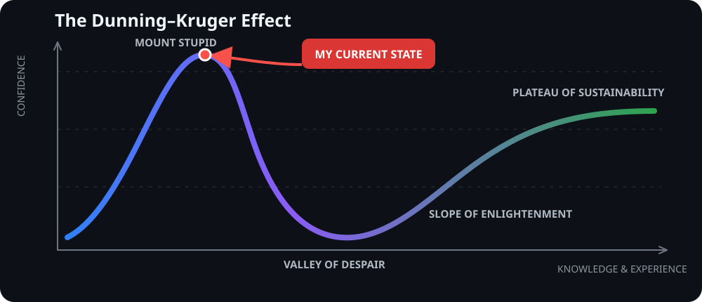

  

  <strong>English</strong> · <a href="./README.ko.md">한국어</a> · <a href="./README.agent.md"><code>AGENT://</code></a>

# Jason

### I build AI systems, mostly local-first ones.

I work across the whole stack of an AI product: the data underneath, the retrieval
and LLM pipelines on top of it, the backend that serves all of it, and the screen
someone eventually clicks. The last part is the one I keep coming back to. A
pipeline nobody opens twice is just an expensive cron job.

Most of what's here started as something I wanted for myself and then got out of hand.

## Where I currently am (allegedly)

## Built with other people

| Project | The short version |
| --- | --- |
| [Beorimi](https://github.com/TrinityBalance/beorimi) | Photograph the junk you want to throw out and it figures out the category and the disposal fee under Gangnam-gu's rules. The AI looks at the photo, the code does the pricing. |
| [My Summer Vacation Diary](https://github.com/TossHackathonTMD/SummerVacationDiary) | A Toss mini app that turns one photo and a few lines into a crayon picture diary. A teacher marks it up and stamps it. |
| [Publium](https://github.com/hansol-dev/team-pubmed) | A workspace for collecting PubMed papers and then talking to them. It shows which sentence an answer came from, not just the answer. |
| [Intero](https://github.com/InteroGames/Intero) | An interrogation game you survive by lying. There are no dialogue options, so whatever you say is whatever you make up. |
| [Byeolil](https://github.com/TrivialOkay/TrivialOkay_toss) | A Toss mini app that takes the most ordinary thing that happened to you today, records it with complete seriousness, and hands back a fortune and an honorary title. |

## What I'm working on

| Project | The short version |
| --- | --- |
| [Galpi](https://github.com/jasonwpgml/galpi) | A navigation protocol that helps coding agents find their way around a codebase. Tested on more than one agent, because one is not evidence. |
| [Autonomous Neuro Drive](https://github.com/jasonwpgml/autonomous-neuro-drive) | A local-first LLM wiki. Everything I do and talk about goes in, and hopefully comes back out as something I can still use next year. |
| [Momento](https://github.com/jasonwpgml/Momento) | Scheduling PWA for tutoring and study groups. Full stack, and yes, it has to work on a phone. |
| [AQR](https://github.com/jasonwpgml/AQR) | A queue-based runner for AI workflows, so a long job failing halfway isn't the end of the world. |

## Smaller things I still like

| Project | The short version |
| --- | --- |
| [ExRater](https://github.com/jasonwpgml/ExRater) | Live exchange rates, with an AI search you can just talk to. |
| [drinklister](https://github.com/jasonwpgml/drinklister) | Turns messy Discord drink orders into clean, exportable data. Exactly as niche as it sounds. |

## What I keep thinking about

- Keeping AI systems local, and keeping what they learn around for the long haul
- How to structure agents, run them together, and tell whether they're any good
- Retrieval: pipelines, embeddings, vector DBs, all the RAG plumbing
- Building full stack with the product in mind, not just the repo

## What I reach for

  

`Streamlit` · `LangChain` · `LangGraph` · `Transformers` · `OpenAI API` · `RAG` · `Vector DB`

## Contributions

<!-- profile-readme-refresh -->
